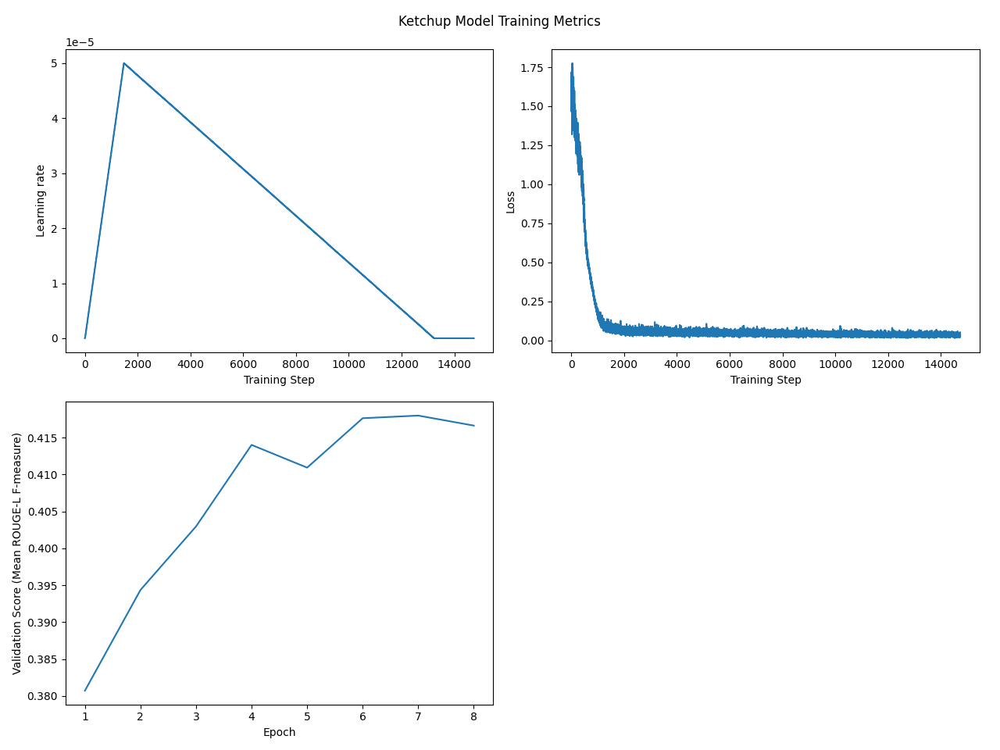

# Ketchup - Discord Chat Summarizer Bot

## Installation

Add Ketchup to a Discord server by clicking [this link](https://discord.com/api/oauth2/authorize?client_id=1131741957597691925&permissions=67584&scope=bot), and selecting the appropriate server from the dropdown.

## Usage

Type the following command to summarize the most recent messages in a channel.
```
!summarize [num]
```
Use the optional `num` parameter to specify how many messages should be included in the summary. If no parameter is given, by default the 20 most recent messages are summarized.

## Technical

Ketchup uses BART ([facebook/bart-base](https://huggingface.co/facebook/bart-base)) finetuned on the [SAMSUM dataset](https://huggingface.co/datasets/samsum). We implement gradient accumulation to train with an effective batch size of 64. The evaluation metric used is the average ROUGE-L score between the model and gold summaries across the validation split.

